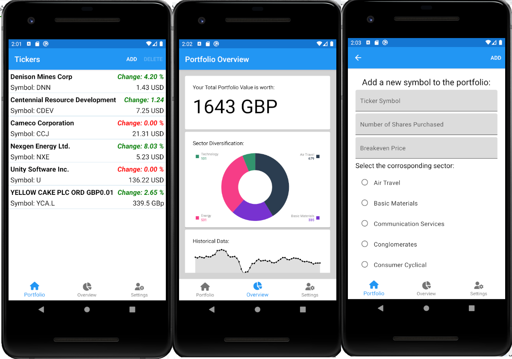

# MobileTicker
iOS and Android App built using Xamarin that tracks both Ticker information and Portfolio Information parsed from Yahoo Finance using JSON.Net.

## Information
- Information is stored in a SQLite Database stored onto the Device.
- Stock information is parsed using Yahoo Finance
- Charts are rendered using MicroCharts Library on github found here https://github.com/microcharts-dotnet/Microcharts
- Choice of Currency Options in the Settings Page. App automatically downloads current exchange rates and converts prices.
- Release builds coming soon...

## Screenshots

